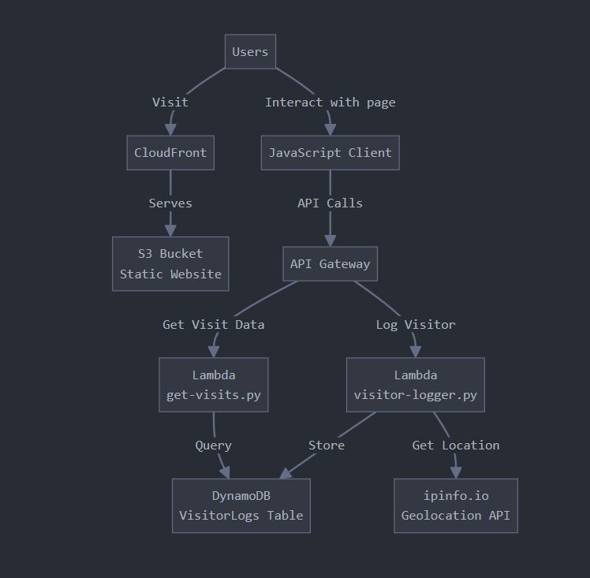

# AWS Serverless Resume Website

## Project Overview
A cloud-based resume website with a visitor counter and location tracking, built using AWS serverless technologies. This project demonstrates practical experience with AWS services, API development, CI/CD pipelines, and full-stack implementation.

## Live Demo
🔗 [View my resume](https://lucas-albuquerque.com)

## Features
- Static website hosted on S3 and distributed via CloudFront
- Serverless API with AWS API Gateway and Lambda
- Visitor counter with geolocation tracking
- Display of recent visitors with country flags
- CI/CD pipeline using GitHub Actions
- Multi-language support (English/Portuguese)
- Mobile-responsive design with dark mode
- Subdomain linked to [JitsiMeet self-hosted server](https://github.com/lucas-rda/jitsi-meet-aws)

## Architecture
This project utilizes the following AWS services:
- **Amazon S3** – Static website hosting
- **Amazon CloudFront** – Content delivery network
- **AWS Lambda** – Serverless backend functions
- **Amazon DynamoDB** – NoSQL database for visitor data
- **Amazon API Gateway** – RESTful API endpoints
- **IAM** – Security and permissions

## Technical Implementation

### Frontend
The frontend is a static HTML/CSS/JavaScript website that:
- Displays professional information in a responsive layout
- Communicates with the backend API to fetch and display visitor data
- Supports toggling between dark/light mode and multiple languages
- Fetches and displays deployment information from a GitHub Actions-generated JSON file

### Backend
The backend consists of two Lambda functions:
1. **visitor-logger** – Captures visitor IP, determines geographic location, and increments the counter
2. **get-visits** – Retrieves overall count and recent visitor information (sorted using a DynamoDB GSI)

### CI/CD
Deployment is automated using **GitHub Actions**. On every push to the main branch:
- The frontend is built and deployed to S3
- A `deployment-info.json` file is uploaded with a timestamp
- Invalidations are triggered for CloudFront to update content globally

### Database
DynamoDB stores:
- A total visitor count
- Individual visitor records with IP, timestamp, country, city, and flag emoji
- A GSI (`ip-timestamp-index`) to support sorting recent visits efficiently

## Challenges Overcome
- Implemented IP tracking with 24-hour deduplication
- Set up proper CORS configuration between S3 and API Gateway
- Built a CI/CD pipeline using GitHub Actions for automated deployments
- Created an efficient DynamoDB schema and indexing strategy

## Learning Outcomes
This project enhanced my skills in:
- Serverless architecture design
- AWS service configuration and integration
- CI/CD automation with GitHub Actions
- NoSQL database design with DynamoDB
- Frontend-backend communication using APIs

## Future Enhancements
- Implement visitor analytics dashboard
- Add multi-region deployment for improved resilience

## Contact
Feel free to reach out if you have any questions about this project!
